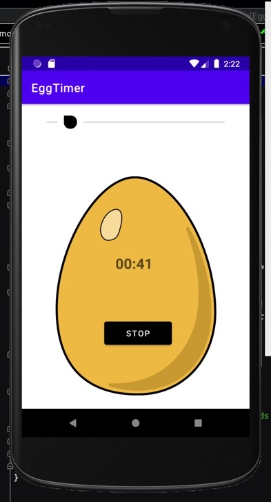
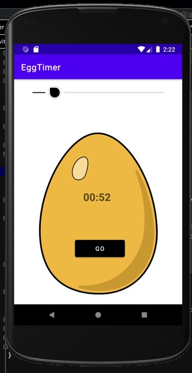

# TimerApp
#### This is mini project - which is a simple android app that acts like a timer , which go button and stop button , also has a seek bar which sets the values of the timer as well.
#### It also plays a sound when the timer reaches 00:00
#### One cant change the value of the timer when the timer is ticking
#### The timer resets to 30 seconds after it reaches to 00:00 and the seek bar is enabled again.
## Preview

## What did I learn while making this project 
- Timers in android
- Seek Bar
- Media Manager
- Styling seek bars
